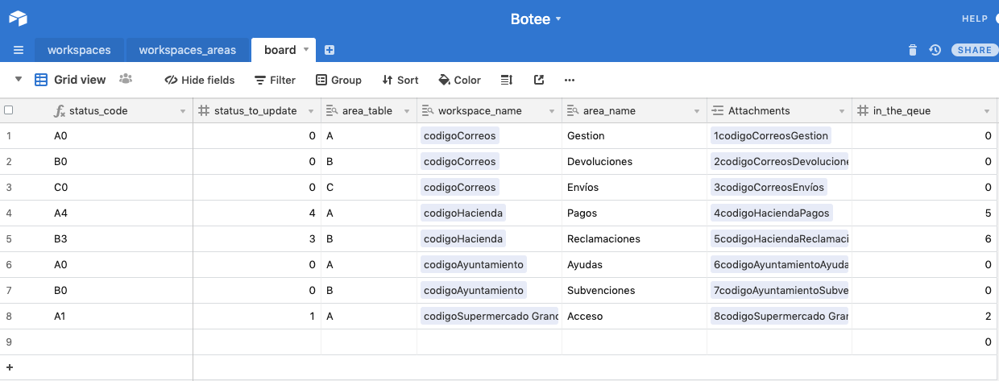
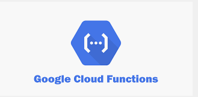

Turno A Distancia - Miniaplicación Conversacional para Gestión de Turnos

El post-coronavirus genera un problema para los gestores de espacios públicos y privados que gestionan grandes cantidades de gente mediante turnos en espacios cerrados.

Estos espacios no están diseñados ni preparados para el distanciamiento social necesario en estas épocas. Sin embargo la gente se ve obligada a aglomerarse en dichos espacios para no perder su turno.

Es por ello que proponemos una solución para que las personas puedan realizar el seguimiento de la cola y conocer su turno, a distancia a travé de Whatsapp.

Al mismo tiempo se crea un sencilla extensión para el navegador de Chrome de manera que cualquier persona encargada de actualizar los turnos, lo puedan hacer sin la necesidad de ningún hardware adicional.

FUNCIONAMIENTO:

Por parte del Gestor del Espacio Público:

1.  Genera un código QR, a través de la página Turnoadistancia.com con el código/password, y el teléfono en el que se encuentra el bot de Whatsapp
2.  La generación del QR también ofrece un archivo PDF con el que facilita el escaneo

Por parte del Usuario:

1.  Escanea el código QR
2.  Activa el enlace (url) que le redirecciona a la aplicación de Whatsapp con el código/Password preescrito
3.  Sin editar nada, envía el código/Password
4.  Este inicializa el bot, y si el código/Password es correcto, se iniciará el bot
5.  Le ofrecerá las diferentes gestiones que puede realizar en el establecimiento
6.  Selecciona el número indicado
7.  Se le asigna el número y se le informa del estado actual de los turnos
8.  Si desea volver a informarse del estado actual de los turnos, solo ha de escribir y enviar la palabra “Cola”

Por parte del responsable de la cola que da paso al siguiente:

1.  Selecciona el icono de la extensión de Turnoadistancia
2.  Escribe el código/password
3.  Se le mostrará el gestor con las diferentes areas
4.  Con apretar el botón de su área, dará paso a la siguiente persona
5.  Al final del día puede resetear los datos y números  

    

CONSTRUCCIÓN PROTOTIPO FUNCIONAL

El proyecto se ha realizado para demostrar la posibilidad de ofrecer una manera segura y eficiente de gestionar espacios. Para ello en un tiempo limitado y con un equipo reducido, hemos decido un acercamiento lean a la hora de la construcción, por ello hemos escogido:

BOT DE WHATSAPP: Landbot.io

Landbot ofrece la posibilidad de crear de manera sencilla y rápida un bot, con su playground. Sin embargo está limitado a que solo un usuario pueda interactuar con el bot, el cual ha asociado su número al playground.

BASE DE DATOS: Airtable.

Con Airtable y su API hemos podido crear en un espacio muy reducido de tiempo, un esqueleto de un modelo de datos, que se podría construir en otro servicio como Mongo.

API y LOGICA: Google Cloud Functions

Construidas con Node.js, ofrecen una manera ligera de comunicar BOT <-> Base de Datos, Extensión <-> Base de Datos

Chrome Extension: Vanilla JS, HTML, CSS y Chrome Browser API

La extensión ha sido creada para cubrir las funcionalidades básicas y lo más generalistas y para poder atender el mayor número de casos

Home:

Hemos generado una mínima app en react. En principio esta App trabajaba con una api en node y una base de datos en mongo, pero por no tener tiempo ni recursos suficientes nos decidimos por optar por un prototipo mínimo, mostrando simplemente el look and feel y funcionalidades mínimas, con la vista puesta a una futura implementación al 100%.